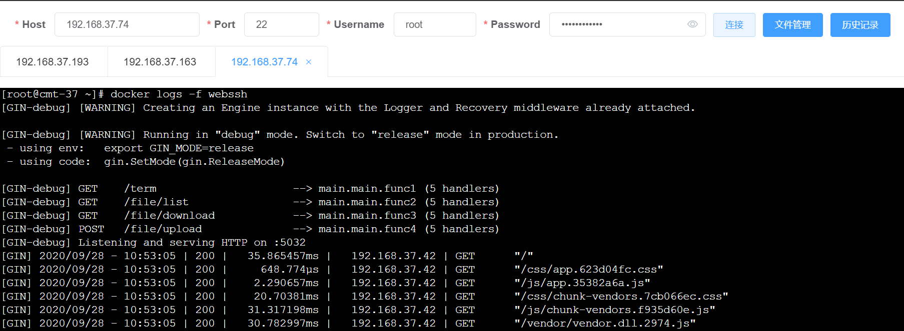
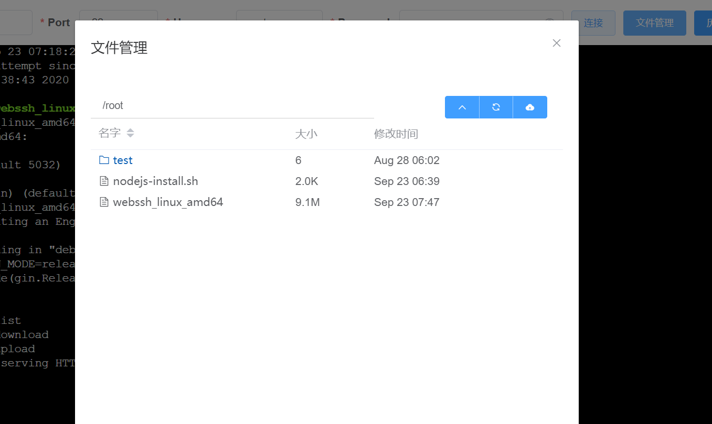

# java webssh
java版本webssh

[](https://www.gnu.org/licenses/gpl-3.0.en.html)   
简易在线ssh和sftp工具, 可在线敲命令和上传下载文件. 端口隧道、http代理tcp（待完成）

## 运行截图




## 背景：
由于所处特殊行业特殊原因，各地机房防火墙一般ssh协议（跨地域访问）都是封禁状态。
同时很多地方机房都不提供诸如堡垒机等形式的运维工具、方法，
造成跨地域的运维工作很难开展。故意尝试使用webssh方式。
go版本webssh standalone模式本来基本够用，但是有的机房甚至开启了http/https白名单模式，只开
放指定的http/https端口，为了简单起见，就需要webssh随业务一起打包启动。
由于业务、部署环境的特殊性，java目前市面上没有很合适的java版本的webssh可供使用.
故参照 [go webssh](https://github.com/Jrohy/webssh) 实现了一版java版本的webssh。

## 功能:
实现的java版本的webssh。
业务代码依赖webssh-core和vue2-web，配置参数即可随业务一起开启webssh功能。

## 原理
```
+---------+     http     +--------+    ssh    +-----------+
| browser | <==========> | webssh | <=======> | ssh server|
+---------+   websocket  +--------+    ssh    +-----------+
```

### go webssh已有功能：
1. 密码方式登录ssh.
2. 私钥方式登录ssh. 
3. 文件上传下载. 
4. 独立部署.

### 添加如下功能：
1. 独立的本地认证
2. 端口转发（TODO）
4. 打包到已有应用中部署适配。（TODO）


## 部署方式

### 独立部署
1. 安装node等软件
2. cmd 进入vue2-web\web, 执行`npm run build`，打包前端资源
3. 修改vue2-sshserver\src\resources\application-prod.yml中webssh的参数，参数详见下文。
4. cmd 进入项目根目录，mvn package
5. copy vue2-sshserver\target\vue2-sshserver-1.26-SNAPSHOT.jar到服务器，
```
使用 java -jar vue2-sshserver-1.26-SNAPSHOT.jar --webssh.allowedUsers=root:changeit@123!:% 启动程序.
其中changeit@123!改为自己的密码。如果不设置webssh.allowedUsers,默认的root会产生一个随机密码，请注意观察控制台日子。
```
6. 浏览器访问 `http://127.0.0.1:5132/webssh/index` 或者`https://127.0.0.1:5443/webssh/index`即可访问.
7. 默认的standalone会开启https，5132会转跳到`https://127.0.0.1:5443/webssh/index`
8. 可通过设置启动参数`--spring.profiles.active=http`使用http only模式。（不建议使用，webssh会直接操作系统，太敏感了）
9. 建议发布生成环境时产生并使用自己的ssl证书。
```
自签名证书生成及配置示例：
例如，cd d:\执行命令：
keytool -genkey -alias springboottomcat -storetype PKCS12 -keyalg RSA -keysize 2048 -keystore websshDefault.p12 -validity 3650 -dname "CN=webssh, OU=NoOU, O=NoO, L=Chendu, ST=Sichuan, C=cn" -storepass "webssh@Admin123!"  -keypass "webssh@Admin123!"
其中alias,keystore,storepass,keypass按需要配置
完成后在d根目录很产生keystore配置文件名的.p12文件，copy到合适的位置
启动命令参考application-prod.yml，配置ssl文件名、路径、密码等信息
后续版本会考虑动态启动时动态生成ssl文件并配置

```
10. 其他更多设置，见[关键参数说明](#关键参数说明)


### docker独立部署
TODO

### 包含到已有项目中
TODO

### 关键参数说明
TODO

**其他语言版本: [English](README_en.md), [中文](README.md).**

