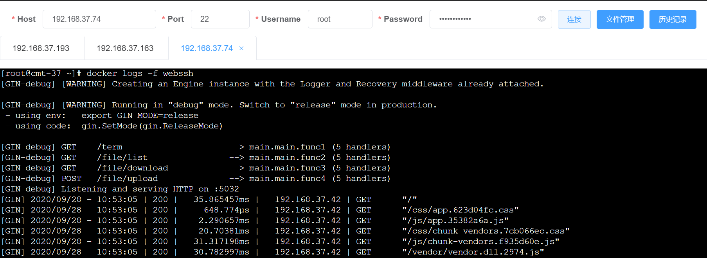

**Read this in other languages: [English](README_en.md), [中文](README.md).**

# java version of webssh
java version of webssh

java version origin from: [go webssh](https://github.com/Jrohy/webssh)

[](https://www.gnu.org/licenses/gpl-3.0.en.html)   
Simple online SSH and SFTP tools, capable of typing commands and uploading and downloading files online Port tunneling, HTTP proxy TCP (TBD)


## Run screenshot




## Background


Due to the special nature of the industry, the SSH protocol (cross regional access) of firewalls in various data centers is generally banned.

At the same time, many data centers do not provide maintenance tools and methods such as bastion machines,

It makes it difficult to carry out cross regional operation and maintenance work. Intentionally attempting to use webssh methods.

The go version of the webssh standalone mode was originally sufficient, but some data centers even enabled the HTTP/HTTPS whitelist mode, only enabling it

Place the specified HTTP/https port, for simplicity, webssh needs to be packaged and started with the business/project.

Due to the unique nature of business and deployment environments and there is no suitable Java version of webssh available on the market

Therefore, refer to [go webssh](https://github.com/Jrohy/webssh) implemented a Java version of webssh.

## Function

The implemented Java version of webssh.

The business code relies on webssh core and vue2 web, and configuration parameters can enable webssh functionality along with the business.

## Principle

```
+---------+     http     +--------+    ssh    +-----------+
| browser | <==========> | webssh | <=======> | ssh server|
+---------+   websocket  +--------+    ssh    +-----------+
```

### major functions

1. Login to SSH using password

2. Login to SSH using private key method

3. File upload and download

4. Independent deployment

5. Independent local authentication

6. Port forwarding (TODO)

7. include into your exists project.

8. Navicat HTTP proxy. (TODO)

## Deployment method

### docker


V1.26 Example:
``` 
docker run  -d -p 5132:5132 -p 5443:5443  --restart always  --name javawebssh -e JAVA_OPTS=“-Xmx1024M -Xms1024M” -e SPRING_BOOT_OPTS=“--spring.profiles.active=docker --webssh.allowedUsers=root:changeit@123![RANDOM]:%,test:test@123!:127.0.0.1” foylian/webssh:1.26
```


may need `--net=host` ?

Key meaning explanation:


Browser Access [http 5132](http://127.0.0.1:5132/webssh/index) Or [https 5443](https://127.0.0.1:5443/webssh/index) You can access it now

It is strongly recommended to modify the '-- webssh.allowedUsers=root:changeit@123![RANDOM]:%,test:test@123!:127.0.0.1'configured account password,

Among them, "[RANDOM]" represents a randomly generated string placeholder during startup, which uses the default account configuration,

The meaning of the parameter configuration "--webssh.allowedUsers=" above is as follows:

Account 1:

Account name: root

Account password: changeit@123 + (When the system starts, a random string of parameters will be given), and the final password needs to be found in the console

Allow login IP: Any IP


Account 2:

Account name: test

Account password: test@123 !

Allow login IP: Only computers with IP 127.0.0.1 are allowed to log in


Docker profile startup will automatically generate an SSL certificate file on the first startup, so it is recommended to use it.

Java memory is set to 1GB by default, for demonstration use, and can be adjusted freely.

For more parameter settings, please refer to [Key Parameter Description](#Key-Parameter-Description)

### standalone

[release v1,26](https://github.com/flian/webssh/releases/tag/V1.26)
I will upload release jar in release page. please refer to download. 

or you can build jar by following steps:

1. Install software such as nodes

2. CMD enters vue2-web\web, executes `npm run build`, and packages front-end resources

(Optional, the dev branch will periodically submit compiled front-end code. To ensure the latest, you can compile the front-end page yourself.)


3. Modify the parameters of webssh in vue2-sshserver\src\resources\application-prod.yml, as shown in [Key Parameter Description](#Key-Parameter-Description)

It is strongly recommended to modify the account and password information that allows logging in to `webssh.allowedUsers`.


4. cmd enters the project root directory, mvn package

5. Copy vue2-sshserver\target\vue2-sshserver-1.26.jar to the server,

```
Java -jar vue2 sshserver-1.26.jar -- webssh. allowedUsers=root:changeit@123!:% 
```

6. Browser access [http 5132](http://127.0.0.1:5132/webssh/index) Or [https 5443](https://127.0.0.1:5443/webssh/index) You can access it now

7. The default standalone will enable HTTPS, and 5132 will redirect to `https://127.0.0.1:5443/webssh/index`

8. You can use the HTTP only mode by setting the startup parameter '--spring.profiles.active=http'. 

9. It is recommended to generate and use your own SSL certificate when publishing the generation environment.


```
Example of generating and configuring self signed certificates:

For example, cd d:\ Execute command:

keytool -genkey -alias springboottomcat -storetype PKCS12 -keyalg RSA -keysize 2048 -keystore websshDefault.p12 -validity 3650 -dname "CN=webssh, OU=NoOU, O=NoO, L=Chendu, ST=Sichuan, C=cn" -storepass "webssh@Admin123!"  -keypass "webssh@Admin123!"

Configure alias, keystore, storepass, and keypass as needed

After completion, generate a.p12 file with the name of the keystore configuration file in the root directory of d and copy it to the appropriate location

Start the command with reference to application-prod.yml, configure SSL file name, path, password, and other information

Subsequent versions will consider dynamically generating SSL files and configuring them during dynamic startup

```

10. For more settings, please refer to [Key Parameter Description](#Key-Parameter-Description)

### Include in existing projects

 include it into existing projects, the major issue is the authentication issue. Let's assume that all existing projects include the front-end and back-end code of webssh.


#### [Required] Project Dependency

develop just test Under Spring Boot 2.5.14。

The components that webssh must rely on include the websocket and validation modules that come with springboot. The following are the project dependencies

For example, please increase or decrease according to the project situation:

```
        <dependency>
            <groupId>org.lotus.carp.webssh</groupId>
            <artifactId>webssh-core</artifactId>
            <version>${project.version}</version>
        </dependency>
        <dependency>
            <groupId>org.lotus.carp.webssh</groupId>
            <artifactId>vue2-web</artifactId>
            <version>${project.version}</version>
        </dependency>
        <dependency>
            <groupId>org.springframework.boot</groupId>
            <artifactId>spring-boot-starter-web</artifactId>
        </dependency>
        <dependency>
            <groupId>org.springframework.boot</groupId>
            <artifactId>spring-boot-starter-websocket</artifactId>
        </dependency>
        <dependency>
            <groupId>org.springframework.boot</groupId>
            <artifactId>spring-boot-starter-validation</artifactId>
        </dependency>

```

At the same time, the following webssh APIs need to be added to the project whitelist:

/webssh/index

/webssh/check

/webssh/shouldVerifyToken

/webssh/projectHeader/params

/webssh/login

/webssh/logout

#### [Optional 1] Only enable webssh authentication

webssh side configuration:

The default configuration has enabled webssh authentication, all you need to do is configure the 'webssh.allowedUsers:' parameter in the project.

Due to relying solely on webssh's own authentication, please note that the password strength here is set to be complex enough, and be careful not to disclose the password.

For more parameter settings, please refer to [Key Parameter Description](#Key-Parameter-Description)


Project side configuration:

Due to only initiating webssh authentication, the project side needs to add `/webssh/**` to the project's own whitelist.


#### [Optional 2] Use project authentication to authenticate the webssh interface

Implement the 'WebSshProjectTokensApi.composeProjectHeaderTokens' method to set the corresponding parameters that the user's subsequent requests need to include in the header.

For example:

In the SampleProjectHeaderController, a "new ProjectHeaderParamVo ("Auth-COOKIE-TEST", RandomUtils.generatePassword(8))" is returned

In the subsequent request header of webssh, there will be an AUTH_COOKIE_TEST parameter with a random string value set here.

When implemented, the identity information of the current user is obtained here, and a token used by the project is returned. This way, all webssh requests will go through the normal authentication process of the project.
For more parameter settings, please refer to [Key Parameter Description](#Key-Parameter-Description)


#### Configure webssh

Finally, add `/webssh/index` to the normal menu and permission management of existing projects. Please stay tuned for more detailed planning of webssh buttons and functional permissions in the future.

For more parameter settings, please refer to [Key Parameter Description](#Key-Parameter-Description)

### Key-parameter-description


webssh.allowedUsers: User configuration information in webssh-independent authentication. Format "username:password:list of allowed IPs to log in"

, default value "root:changeit@123![RANDOM]:%,test:test@123!:127.0.0.1 "

Indicating meaning,

Root:changeit@123![RANDOM]:%

Allow login username: root

Password: changeit@123 + Random characters generated by the system,

Allow login from any IP address.


Test:test@123!:127.0.0.1

Allow login username: test

Password: test@123!

Allow login for IP: 127.0.0.1


It is strongly recommended to configure this parameter when using it and keep it confidential.

If you do not want to enable webssh authentication using configuration mode, you can set webssh. forceCheckUserConfig2Prad=false,

And independently implement the WebSshLoginService interface.


Webssh.shouldVerifyToken: Whether to enable independent authentication of webssh pages and APIs. Default value: true

webssh by default includes a token authentication, and when true, there will be a separate login page,

The authentication page will verify the user configured by webssh.allowedUsers, and upon success, it will return a message

Token is given to the front-end, and subsequent interface calls to webssh will carry this token.


webssh.tokenExpiration: The expiration time of the webssh independent authentication token. Default value: 6, in hours.


webssh.savePass: Does the front-end "history" remember the password for SSH,

After setting it to true, the SSH password will be stored in the local storage of the front-end. It is not recommended to enable it. The default value is false


Webssh.debugJsch2SystemError: Do you want to open the debug information for jsch,

It can be turned on when debugging source code is required. Default value: false


webssh.forceCheckUserConfig2Pro: Is strict verification enabled for webssh.allowedUsers

Configure user information. The default value is true After activation, the strength of the account will be verified.


Webssh.enableRandomPwd: Should random strings be used to replace the webssh. allowedUsers configuration during startup

[RANDOM] field and print the generated password information on the console. The default value is true.


Webssh.defaultConnectTimeOut: The default timeout for connecting to a remote ssh server using jsch

The default value is 30 * 1000, indicating 30 seconds


webssh.webSshTermPtyType: The ttype type of the jsch connection server, default value: xterm. Optional: vt100, etc.

Please refer to the RFC for SSH2 for details.


webssh.sshPrivateKeyOnly: Whether to enable password login authentication when JSCH connects to a remote server.

Default value: false Both the password and private key allow login.

In specific environments, it can be set to true, indicating that only private key login to remote servers is allowed.


Webssh.foreHttps: Do you want to force the activation of webssh https. Default value: false

Project dependency mode is disabled here, and configuration follows the configuration of the main project

Standalone defaults to true because the information running in webssh is too sensitive, and HTTPS can slightly enhance security.

(It is strongly recommended that students in standalone mode generate their own SSL certificates and do not use default configurations)


webssh.underContainer: The name of the container used by the application. Default value:“”,

Only meaningful when combined with webssh. foreHttps=true

Project dependency mode, where the default value is "", which means there is no configuration to enable default HTTP redirection to HTTPS

The default value for standalone mode here is "tomcat", which will enable the configuration in TomcatHttpsConfig,

Enable HTTP to forcibly redirect to HTTPS, specific configuration parameters vue2 sshserver module


webssh.dateFormat: The date format involved on the websshpage. Default value: "yyyy-MM-dd HH:mm:ss"


webssh.maxSshShellTermCorePoolSize: The maximum number of consoles that can be opened in webssh. Default value: 1000


webssh.randomPwdWord: The default value is [RANDOM]. When starting, random characters need to be generated in the password to generate a replacement string.


### webssh API Description

```

/webssh/index webssh homepage

/webssh/check checks the validity of SSH account passwords

/webssh/shouldVerifyToken check is  enabled for webssh independent authentication

/webssh/projectHeader/params pull Additional tokens required for  webssh API requests

/webssh/login: webssh independent authentication login interface

/webssh/logout webssh independent authentication and logout interface

/webssh/file/list pulls file directory information for the terminal

/webssh/file/download  download remote server file

/webssh/file/upload Upload the specified file to the specified directory


Websocket URL (ws/wss):

/webssh/term websocket for connect to remote server

/webssh/file/progress retrieves the upload progress of the specified file


```


### others


please refer module README for module detail


release to your private repository: mvn deploy -Dmaven.test.skip=true

release maven plugin ： see [maven-release-plugin](https://maven.apache.org/maven-release/maven-release-plugin/) for more detail

maven prepare : mvn release:prepare
maven perform : mvn release:perform


